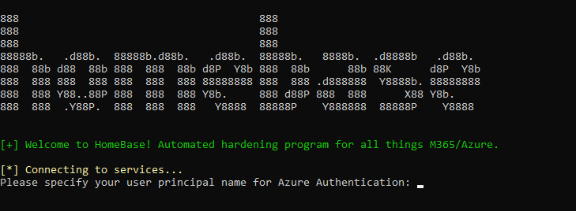

# Home Base


Powershell script used to deploy baseline configurations & best practice hardening for O365, Azure AD, and Azure Tenants. This includes:
* Conditional Access Policies
* Exchange Online Protection Policies
* Intune MDM & MAM
* Application Protection Policies
* Best practice hardening

The script can be used to deploy baseline changes in Greenfield or Brownfield deployment. The process flow creates a test user and group, assigns the test user to the created group, and will deploy all appropriate protections against the created group. This process is completed to prevent any disruption to business operations and locking people out.

For better customisation, the script has been designed to read JSON files based on the folder structure. If you or your organisation would like to apply different sets of controls, export the JSON file and import it to the appropriate folder.

`Example: For different MDM Applications to provide MAM policies for, upload the JSON file to the Android or iOS folder and it will be applied when running the script.`

Special thanks to Soteria for the great 365-Inspect tool to help identify best practice improvements in all things 365.


## :arrow_down: Download
```
git clone https://github.com/rjsudlow/homebase
```


## :computer: Setup
Runs without issue with PowerShell 5.x. Setup will check for dependencies at runtime - if any are missing, they will be installed.


## :rocket: Usage
```
.\homebase.ps1
```
You may need to run additional scripts/manually upload to apply baselines. As it stands currently, you will need to perform the current actions:
* Manually create Android MDM Application Protections (iOS works fine and uploads automatically on script execution)
* Use `Resources\ImportSecurityPolicies.ps1` to upload the 3 files located in `EndpointSecurityPolicies`.
* Use PS 7.x to run `Resources\Add-ConditionalAccessPolicy.ps1` (MS-Graph and PowerShell 5.x error with `@params` variable)


## :compass: Roadmap/Current Hardening Steps

### AzureAD
* :white_check_mark: Create Pilot User
* :white_check_mark: Create Pilot Group
* :white_check_mark: Apply Conditional Access

### Endpoint Manager
* :white_check_mark: Apply Compliance Baselines
  * Windows 10
  * Android
  * iOS
* :white_check_mark: Apply Configuration Policies
  * Defender for Endpoint
  * Bitlocker
* :white_check_mark: Apply MDM/MAM Policies
  * iOS
  * Android
* :white_check_mark: Apply Application Protection Policies
  * iOS
  * Android

## :camera: Images


### M365/Azure/SharePoint/Teams
* Apply 365Inspect Controls


### To Do
* Assign policies and templates to group created as part of script.
* Upload Endpoint Security Policies from folder.
* Apply EOP Policies
* PowerShell 7.x support.


## Disclaimer
>This should go without saying, but this tool is for academic purposes only. I'm not responsible if you want to use this
for nefarious deeds. Please pay special attention to all local, state, and federal laws. Remember:
"With great power comes great responsibility."

This project is licensed under the Apache License - see the [LICENSE](LICENSE) file for details.
